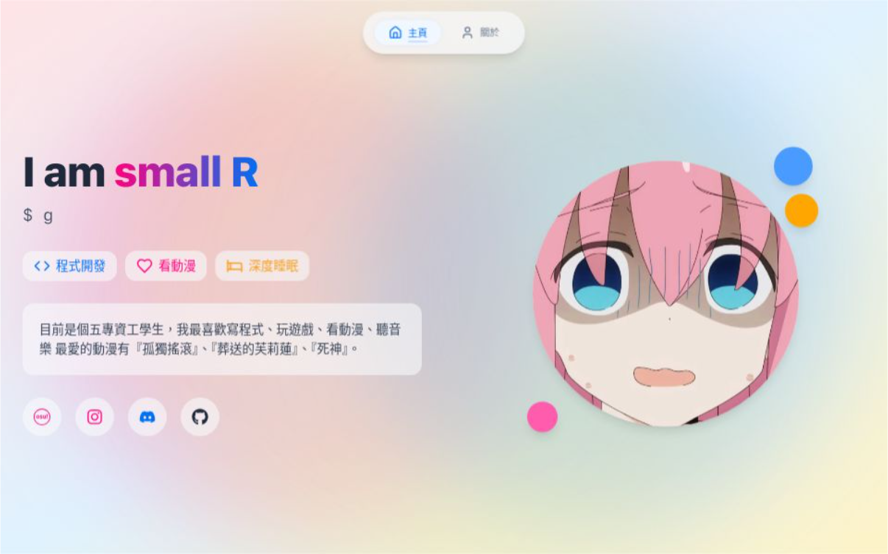

<div align="center">
  <h1>small R - Personal Website</h1>
  <p>A modern, responsive personal website built with Next.js and Tailwind CSS</p>
  
</div>

[English](./README.md) | [中文](./README_ZH.md)

## 🌟 Overview

This is my personal website showcasing my projects, interests, and skills. Built with modern web technologies and featuring a clean, responsive design.

### ✨ Key Features

- **Modern Design**: Clean and minimalist interface with smooth animations
- **Responsive Layout**: Optimized for all devices from mobile to desktop
- **Anime Integration**: Featuring my favorite anime and related content
- **Project Showcase**: Highlighting my programming projects and skills

### 🛠️ Tech Stack

- **Framework**: Next.js 15 (App Router)
- **Styling**: Tailwind CSS
- **Animations**: Framer Motion
- **Icons**: Lucide React & React Icons
- **Type Safety**: TypeScript

### 🚀 Getting Started

1. **Clone the repository**

```
git clone https://github.com/Ynoob87/about-small.git
```

2. **Install dependencies**

```bash
cd about-small
npm install
```

3. **Start development server**

```bash
npm run dev
```

### 🌐 Deployment

1. **Build for production**

```bash
npm run build
```

2. **Deploy to Vercel (Recommended)**

- Fork this repository
- Import to [Vercel](https://vercel.com)
- Vercel will automatically detect Next.js and deploy

3. **Deploy to other platforms**

- Build the project: `npm run build`
- Start production server: `npm start`
- Or deploy the `out` directory to any static hosting:
  - GitHub Pages
  - Netlify
  - Cloudflare Pages

### 📂 Project Structure

```
about-small/
├── app/                # Next.js app directory
├── components/         # React components
│   ├── cards/         # Card components
│   └── sections/      # Page sections
├── public/            # Static assets
└── types/             # TypeScript definitions
```

### 🌈 Special Features

- **Hero Section**: Dynamic welcome screen and self-introduction
- **About Me**: Showcase personal background and interests
- **Anime World**: Share favorite anime works
- **Programming World**: Showcase developed project works

### 📝 Development Notes

1. **Code Style**

- Use ESLint and Prettier to maintain consistent code style
- Run `npm run lint` before committing to check code

2. **Type Checking**

- Ensure all TypeScript files have appropriate type definitions
- Run `npm run type-check` to check types

3. **Performance Optimization**

- Use appropriate image formats and sizes
- Implement appropriate caching strategies
- Optimize component re-rendering

4. **Browser Support**

- Support the latest two versions of major browsers
- Use CSS prefix processing

## 📄 License

This project is licensed under the MIT License - see the [LICENSE](LICENSE) file for details.

---

<div align="center">
  <p>Made with ❤️ by small R</p>
  <p>
    <a href="https://github.com/Ynoob87">GitHub</a> |
    <a href="https://www.instagram.com/ryros_/">Instagram</a> |
    <a href="https://discord.gg/your-permanent-invite">Discord</a>
  </p>
</div>
